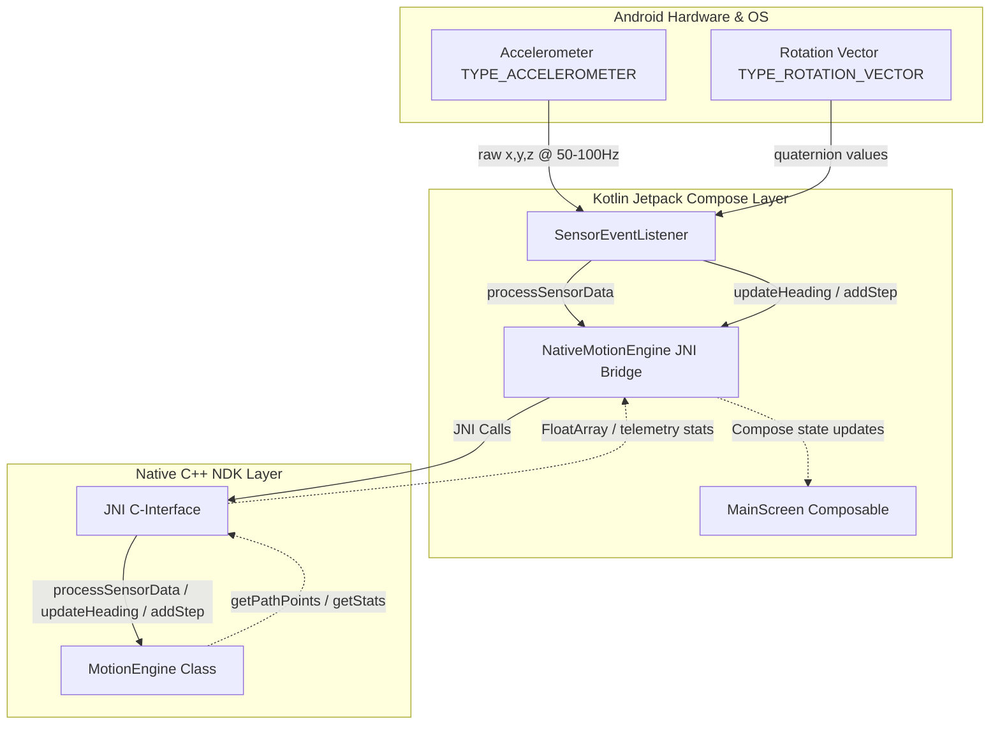

# Architecture Documentation - IMU Motion Tracer

This document details the system design, data flows, and software architecture of the **IMU Motion Tracer** application.

---

## 1. System Overview

The application is structured into three main layers: the **Android Sensor Layer** (delivering hardware sensor updates), the **Kotlin UI & Bridge Layer** (handling the Compose layout, gestures, and JNI calls), and the **Native C++ Engine** (processing dead-reckoning equations and step estimation).

### High-Level Component Diagram



---

## 2. Core Architectural Components

### A. Kotlin / UI Layer
*   **[MainActivity](file:///c:/Users/user/Desktop/IMU%20Motion/app/src/main/java/com/example/imumotiontracer/MainActivity.kt)**: The entry point hosting the Compose surface.
*   **[MainScreen](file:///c:/Users/user/Desktop/IMU%20Motion/app/src/main/java/com/example/imumotiontracer/ui/main/MainScreen.kt)**:
    *   Manages user settings states (`stepLength`, `sensitivity`, `filterAlpha`).
    *   Registers sensor listeners for raw Accelerometer and Rotation Vector data.
    *   Implements an interactive vector `Canvas` that draws grid coordinates, historical walking trails, and real-time orientation indicators. Gesture listeners (`detectTransformGestures`) calculate scaling and offsets for panning and pinching.
    *   Manages automated coroutine jobs to run simulation scripts.
*   **[NativeMotionEngine](file:///c:/Users/user/Desktop/IMU%20Motion/app/src/main/java/com/example/imumotiontracer/NativeMotionEngine.kt)**:
    *   Loads the native C++ library (`motion-engine`).
    *   Instantiates the C++ backend object, holding its raw heap pointer (`nativePtr: Long`).
    *   Acts as a thread-safe wrapper exposing simple Java-friendly methods that delegate to native functions.

### B. C++ NDK Engine
*   **[motion-engine.h](file:///c:/Users/user/Desktop/IMU%20Motion/app/src/main/cpp/motion-engine.h) & [motion-engine.cpp](file:///c:/Users/user/Desktop/IMU%20Motion/app/src/main/cpp/motion-engine.cpp)**:
    *   Written in native C++ for high performance, memory efficiency, and real-time processing capability.
    *   Implements a double-buffer design using `std::deque` history windows for low-pass and high-pass accelerometer magnitude filters.
    *   Uses JNI (Java Native Interface) export declarations (`extern "C"`) to map Java parameters into standard C++ types.

---

## 3. Data Processing & Algorithms

### A. Vibration Filter & Step Detection
1. **Raw Magnitude**: Acceleration vectors $(x, y, z)$ are converted to magnitude:
   $$RawMag = \sqrt{x^2 + y^2 + z^2}$$
2. **Dynamic Gravity Estimation**: The engine keeps a running average of `RawMag` over `AVERAGING_TIME_INTERVAL_MS` (2.5 seconds) to track local gravity forces dynamically.
3. **Low-Pass Filter**: A second running average is calculated over `FILTER_TIME_INTERVAL_MS` (200 milliseconds) to filter out high-frequency hand vibration.
4. **Zero-Alignment**: Gravity is subtracted from the filtered magnitude to get the motion-only acceleration signal:
   $$FilterMagnitude = LowPassMagnitude - RunningGravity$$
5. **Crossover Peak Detection**: A step event is registered when `FilterMagnitude` crosses from below the `sensitivity` threshold to above it, subject to dynamic debounce constraints.
6. **Weinberg Stride Estimation**: Stride length is estimated dynamically using the peak amplitude over a 700ms window:
   $$Stride = K \cdot \sqrt[4]{MaxMagnitude - MinMagnitude}$$

### B. Heading Integration
*   **Continuous Rotation Mapping**: The Android Rotation Vector sensor computes quaternions, which are converted to azimuth rotation angles.
*   **High-Frequency Circular Smoothing**: Heading angles are smoothed continuously in C++ at ~50Hz:
    $$SmoothedSin = \alpha \cdot \sin(\theta) + (1 - \alpha) \cdot SmoothedSin$$
    $$SmoothedCos = \alpha \cdot \cos(\theta) + (1 - \alpha) \cdot SmoothedCos$$
    $$CurrentHeading = \text{atan2}(SmoothedSin, SmoothedCos)$$
*   **Coordinate Integration**: When a step event triggers, the engine projects the next path coordinate relative to the current position:
    $$CurrentX = CurrentX + Stride \cdot \sin(CurrentHeading)$$
    $$CurrentY = CurrentY - Stride \cdot \cos(CurrentHeading)$$

---

## 4. Threading & Lifecycle Model

```
           [Main UI / Sensor Thread]                    [NDK Mutex Boundary]
                      │                                          │
    SensorEvent (Accel) ───────> JNI call ─────────> lock(engineMutex) (Acquires lock)
                                                           │     ├── processSensorData
                                                           │     └── (returns stepDetected)
                        <─────── Returns ─────────── unlock(engineMutex) (Releases lock)
```

### Mutex Synchronization
All read/write operations inside the C++ `MotionEngine` are synchronized using a mutex (`mutable std::mutex engineMutex`).
This prevents race conditions between:
*   **High-frequency continuous updates** (e.g., continuous heading updates at 50Hz).
*   **Step events** (updating path coordinate queues at ~1Hz).
*   **UI requests** (querying float arrays of coordinate points for redraws).

### Memory Lifecycle
The C++ heap memory is tied to the life of the `NativeMotionEngine` Kotlin wrapper:
*   Created on initialization of the Jetpack Compose screen view model or remember block using JNI `createEngine`.
*   Cleaned up surgically via JNI `destroyEngine` inside the `NativeMotionEngine.destroy()` method, called inside Jetpack Compose's `DisposableEffect` callback or Kotlin's finalizer hooks to prevent NDK memory leaks.
